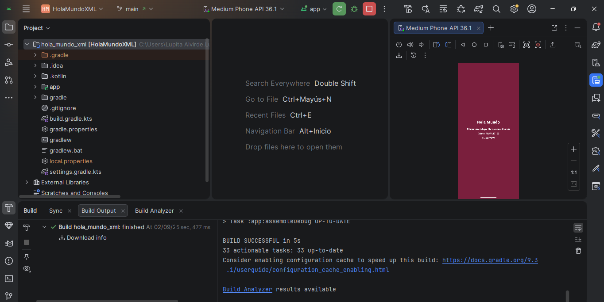
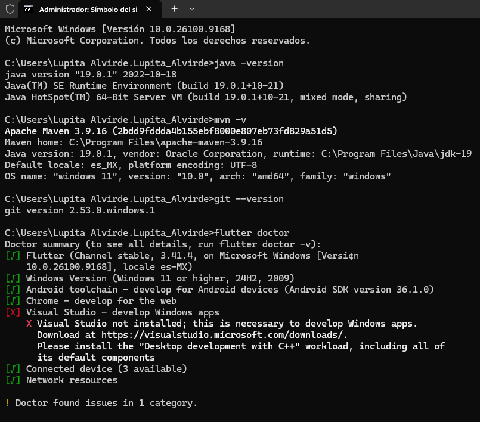
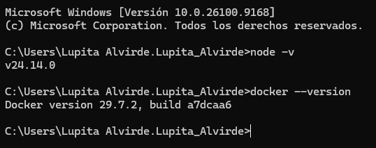
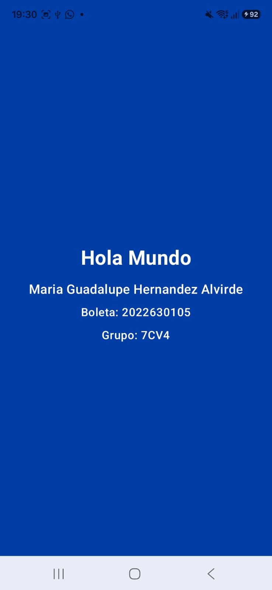

# Aplicaciones Móviles - Práctica 1

Instalación y Funcionamiento de los Entornos Móviles.
Instituto Politécnico Nacional — Escuela Superior de Cómputo.
Ingeniería en Sistemas Computacionales / Desarrollo de aplicaciones móviles nativas.

**Nombre completo:** Maria Guadalupe Hernandez Alvirde
**Número de boleta:** 2022630105
**Grupo:** 7CV4

## Estructura del repositorio

```
AplicacionesMoviles/
├── hola_mundo_xml/       # Versión 1: Android nativo con Views (XML), Kotlin
├── hola_mundo_compose/   # Versión 2: Android nativo con Jetpack Compose
├── hola_mundo_flutter/   # Versión 3: Flutter
└── capturas/             # Evidencias en imagen del proceso e ejecución
```

Cada carpeta de proyecto contiene su propio `.gitignore` adecuado a la tecnología.

## Herramientas instaladas

| Herramienta | Descripción | Versión instalada | Sistema operativo |
|---|---|---|---|
| Android Studio | IDE oficial para desarrollo Android, incluye el emulador. | Panda 2 \| 2025.3.2 | Windows 11 |
| JDK (Amazon Corretto) | Distribución de OpenJDK usada para compilar y ejecutar Java/Kotlin. | 19.0.1 | Windows 11 |
| Maven | Automatiza la construcción de proyectos y gestión de dependencias. | 3.9.16 | Windows 11 |
| Git | Control de versiones. | 2.53.0 | Windows 11 |
| Flutter SDK | SDK de Google para apps multiplataforma. | 3.41.4 (channel stable) | Windows 11 |
| Node.js | Entorno de ejecución de JavaScript del lado del servidor. | v24.14.0 | Windows 11 |
| Docker | Plataforma de contenedores. | 29.7.2 | Windows 11 |

## Descripción de los tres proyectos

### 1. `hola_mundo_xml` — Android nativo con Views (XML)
Proyecto creado con la plantilla *Empty Views Activity* (Kotlin). La interfaz se define en el layout
`activity_main.xml` usando `ConstraintLayout` y cuatro `TextView` para mostrar "Hola Mundo", nombre,
boleta y grupo, sobre un fondo guinda (color representativo del IPN).

**Cómo ejecutarlo:**
1. Abre la carpeta `hola_mundo_xml` en Android Studio (`File → Open`).
2. Espera a que sincronice Gradle.
3. Ejecuta con el botón ▶️ Run sobre un emulador o dispositivo físico.

### 2. `hola_mundo_compose` — Android nativo con Jetpack Compose
Proyecto creado con la plantilla *Empty Activity (Compose)*. Un composable propio (`HolaMundoScreen`)
muestra la información mediante componentes `Text` dentro de un `Column`/`Surface`, aplicando modificadores
de color, tipografía (`FontFamily`, `FontWeight`) y padding. El fondo es azul, color representativo de ESCOM.

**Cómo ejecutarlo:**
1. Abre la carpeta `hola_mundo_compose` en Android Studio (`File → Open`).
2. Espera a que sincronice Gradle.
3. Usa la anotación `@Preview` (`HolaMundoScreenPreview`) para verlo dentro del IDE, o ejecuta con ▶️ Run
   sobre un emulador o dispositivo físico.

### 3. `hola_mundo_flutter` — Flutter
Proyecto generado con `flutter create hola_mundo_flutter`. El archivo `lib/main.dart` usa `MaterialApp`,
`Scaffold` y los widgets `Text`/`Column` para mostrar la información solicitada, sobre un fondo lila.

**Cómo ejecutarlo:**
```bash
cd hola_mundo_flutter
flutter pub get
flutter run
```
Elige el emulador o dispositivo físico donde quieras instalarla cuando la terminal lo pregunte.

## Capturas de pantalla

### Proceso de instalación y configuración

Android Studio con el emulador ejecutando la app y build exitoso:



Verificación de versiones — `java -version`, `mvn -v`, `git --version`, `flutter doctor`:



Verificación de versiones — `node -v`, `docker --version`:



### Aplicaciones en ejecución

| Views/XML | Jetpack Compose | Flutter |
|---|---|---|
|  |  |  |

## Dificultades encontradas y solución

- **Error de `compileSdk` (AAR metadata):** al crear los proyectos de Android (XML y Compose), Android Studio
  usó por defecto `compileSdk 36.1`, pero las versiones más recientes de `androidx.core` y
  `androidx.lifecycle` exigen compilar contra la API 37. **Solución:** se actualizó `compileSdk` y
  `targetSdk` a `37` en `app/build.gradle.kts` de ambos proyectos, y se instaló la plataforma **API 37**
  desde el SDK Manager.
- **NDK corrupto al correr Flutter (`CXX1101`):** al ejecutar `flutter run` por primera vez, Gradle marcó
  que el NDK descargado en `C:\Android\Sdk\ndk\28.2.13676358` no tenía el archivo `source.properties`
  (descarga incompleta). **Solución:** se borró esa carpeta y se dejó que el Android Gradle Plugin la
  volviera a descargar automáticamente en el siguiente build.
- **Bloqueo de Gradle entre proyectos (`Timeout waiting to lock build logic queue`):** al tener Android
  Studio abierto con otro proyecto mientras se corría `flutter run`, ambos procesos compitieron por el mismo
  daemon de Gradle. **Solución:** cerrar/terminar el proceso de Gradle que tenía el lock y volver a intentar.
- **Ubicación por defecto de los proyectos:** al crear los proyectos desde el asistente de Android Studio,
  se guardaron por defecto en `AndroidStudioProjects/` en lugar de dentro del repositorio. **Solución:** se
  copiaron los archivos generados a la carpeta correspondiente dentro de `AplicacionesMoviles/`, conservando
  el `gradle-wrapper.jar` real y excluyendo cachés (`.gradle`, `.idea` de build, `local.properties`).
- **`Run configuration 'app' is not supported... Cannot obtain the application ID`:** apareció tras un sync
  de Gradle fallido por el error de `compileSdk`. **Solución:** al corregir el `compileSdk` y volver a
  sincronizar sin errores, la configuración de ejecución se regeneró correctamente.

## Comparación entre los tres enfoques

**Facilidad de desarrollo:** Jetpack Compose fue el más directo para expresar la interfaz, ya que todo el
diseño (colores, tipografía, distribución) se escribe en Kotlin dentro de la misma función, sin cambiar de
archivo. Views/XML requiere ir y venir entre el layout XML y la actividad Kotlin, lo que lo hace un poco más
lento de iterar, aunque el editor visual de Android Studio ayuda. Flutter fue el más rápido de poner en
marcha una vez configurado el SDK, gracias al hot reload, aunque su primera compilación (descarga de
dependencias y del NDK) fue la más tardada.

**Cantidad de código:** Views/XML necesitó dos archivos (layout + actividad) y bastante código repetitivo
(`app:layout_constraint...` en cada `TextView`). Compose redujo el código a una sola función con los
`Text` anidados, sin necesidad de un archivo de layout separado. Flutter fue el más compacto: un solo
`main.dart` con un widget `Column` bastó para todo.

**Diferencias en el diseño de la interfaz:** Views/XML separa claramente estructura (XML) de comportamiento
(Kotlin), lo cual es más declarativo pero más verboso. Compose y Flutter comparten una filosofía similar
(UI declarativa en código, widgets/composables anidados), aunque Compose se integra de forma nativa con el
resto del ecosistema Android (temas de Material 3, `@Preview`), mientras que Flutter construye su propio
árbol de widgets independiente de la plataforma, lo que le permite compilar a Android, iOS, web y escritorio
desde el mismo código.

## Conclusiones

Las tres formas de construir la interfaz llegan al mismo resultado visual, pero con filosofías distintas:
Views/XML es el enfoque más tradicional y explícito, Compose moderniza el desarrollo nativo de Android
haciéndolo declarativo sin salir del ecosistema de Kotlin/Android, y Flutter apuesta por un motor de
renderizado propio que sacrifica la integración nativa a cambio de portabilidad multiplataforma. Durante la
instalación, la mayoría de los problemas no vinieron de las herramientas en sí, sino de desajustes de
versiones (SDK, NDK) entre lo que el asistente de Android Studio configura por defecto y lo que las
dependencias más recientes exigen — algo que probablemente se irá repitiendo conforme salgan nuevas
versiones de Android y del Android Gradle Plugin.
