<div align="center">

# INSTITUTO POLITÉCNICO NACIONAL
### ESCUELA SUPERIOR DE CÓMPUTO

<br/>

## **Desarrollo de Aplicaciones Móviles Nativas**
### **Práctica 3: Aplicaciones Nativas**

---

**Profesor:** M. en C. Gabriel Hurtado Avilés  
**Grupo:** 7CV4 &nbsp;|&nbsp; **Ciclo Escolar:** 2027-1  
**Semestre:** 2027-1  

---

### **Integrantes del Equipo**

| Nombre Completo | Boleta |
| :--- | :---: |
| **Hernández Alvirde María Guadalupe** | 2022630105 |
| **Aragón Martínez Manuel Alejandro** | 2023630411 |

<br/>

**Ciudad de México, Septiembre de 2026**

---

</div>

<br/>

## 📋 Responsable del equipo utilizado

- **Nombre:** Maria Guadalupe Hernandez Alvirde  
- **Boleta:** 2022630105  
- **Equipo:** DELL Latitude 7480  
- **Procesador:** Intel(R) Core(TM) i7-6600U CPU @ 2.60GHz (2.80 GHz, 2 núcleos, 4 hilos)  
- **RAM:** 16.0 GB (15.9 GB utilizable, 2133 MHz)  
- **Almacenamiento:** 477 GB SSD (203 GB usados, ~274 GB libres)  
- **Gráficos:** Intel(R) HD Graphics 520 (128 MB)  
- **Justificación:** Al analizar las especificaciones de los equipos disponibles, se seleccionó esta laptop debido a que cuenta con 16 GB de memoria RAM, procesador Core i7 con virtualización Intel VT-x activa y más de 270 GB de almacenamiento libre. Esto permite asignar holgadamente 8 GB de RAM al contenedor de macOS y soportar el peso de Xcode y los simuladores sin saturar el sistema operativo anfitrión.

---

## 🗓️ Registro de sesiones de trabajo colaborativo

| # | Fecha | Inicio | Término | Modalidad | Integrantes presentes | Actividades realizadas | Evidencia |
|---|---|---|---|---|---|---|---|
| 1 | 27/09/2026 | 18:00 | 21:00 | Remota (videollamada con pantalla compartida) | Hernandez Alvirde Maria Guadalupe, Aragón Martínez Manuel Alejandro | Comparativa y elección de la PC; clonado de MacOS-Docker; instalación y verificación de WSL 2 con Ubuntu; configuración de `.wslconfig` (virtualización anidada); verificación de aceleración KVM (`kvm-ok`); solución gráfica vía servidor VNC (TigerVNC en puerto 5999 tras falla de renderizado en WSLg); arranque de macOS Recovery, particionado APFS en Disk Utility e inicio de instalación de macOS Ventura. | Capturas 01–17 en carpeta `capturas/` |
| 2 | 28/09/2026 | hh:mm | hh:mm | Remota / Presencial | Hernandez Alvirde Maria Guadalupe, Aragón Martínez Manuel Alejandro | Finalización de instalación de macOS Ventura; configuración inicial del sistema; instalación de Xcode, Homebrew y CocoaPods; ejecución de proyecto Swift de prueba en simulador de iPhone. | Por documentar |
| 3 | 28/09/2026 | hh:mm | hh:mm | Presencial / Remota | Hernandez Alvirde Maria Guadalupe, Aragón Martínez Manuel Alejandro | Desarrollo y pruebas de aplicaciones nativas y multiplataforma (SwiftUI, Flutter, Kotlin Multiplatform). | Por documentar |

---

# Ejercicio 1: Instalación de macOS en la mejor PC del equipo

## 1.1 Identificación y comparativa del equipo

Para determinar qué máquina albergaría el entorno de desarrollo con macOS virtualizado en Docker, se evaluaron las características de hardware de los integrantes:

| Integrante | Procesador | RAM | Almacenamiento | GPU |
|---|---|---|---|---|
| **Maria Guadalupe Hernandez Alvirde** | Intel(R) Core(TM) i7-6600U CPU @ 2.60GHz (2.80 GHz) | 16.0 GB (2133 MHz) | 477 GB SSD (274 GB libres) | Intel(R) HD Graphics 520 (128 MB) |
| **Manuel Alejandro Aragón Martínez** | Intel(R) Core(TM) i5-8265U CPU @ 1.60GHz (hasta 3.90 GHz) | 8.0 GB | 256 GB SSD | Gráficos integrados (Intel UHD Graphics 620) |

**Equipo seleccionado:** Laptop DELL Latitude 7480 de Maria Guadalupe Hernandez Alvirde (Boleta: 2022630105).  

**Justificación técnica de la elección:**
1. **Memoria RAM disponible:** El despliegue de Docker (`docker run`) asigna 8 GB de RAM exclusivamente a la máquina virtual de macOS (`-e RAM=8`), y la configuración de `.wslconfig` reserva hasta 12 GB para WSL 2. En la computadora de Manuel Alejandro (8 GB de RAM en total), esta asignación provocaría un consumo del 100% de la memoria física y un colapso del sistema operativo anfitrión. En cambio, la máquina de Maria Guadalupe (16 GB de RAM) cuenta con margen suficiente para ejecutar Windows, Docker y la máquina virtual simultáneamente.
2. **Capacidad de almacenamiento:** La imagen base de Docker-OSX, el sistema operativo macOS Ventura, el IDE Xcode (~12-15 GB) y los simuladores de iOS requieren decenas de gigabytes libres. La laptop seleccionada cuenta con más de 270 GB de espacio libre en disco sólido frente a los 256 GB totales del equipo secundario.
3. **Aceleración por hardware:** La máquina elegida cuenta con virtualización por hardware (Intel VT-x) activada en firmware, indispensable para habilitar el módulo KVM en Linux y lograr un rendimiento utilizable en el entorno emulado.

### Evidencia de especificaciones del hardware seleccionado
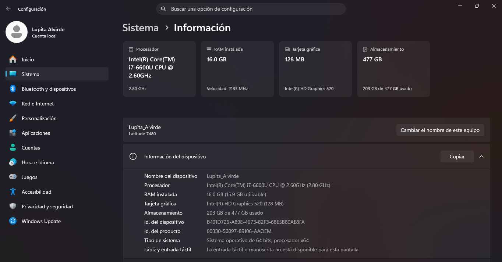

---

## 1.3 Instalación del entorno macOS con Docker paso a paso

### Paso 1. Clonar el repositorio oficial
Se clonó el repositorio oficial `MacOS-Docker` desde GitHub dentro del directorio de trabajo de la práctica:

```cmd
cd C:\Users\Lupita Alvirde.Lupita_Alvirde\Practica3
git clone https://github.com/gabrielhuav/MacOS-Docker.git
```

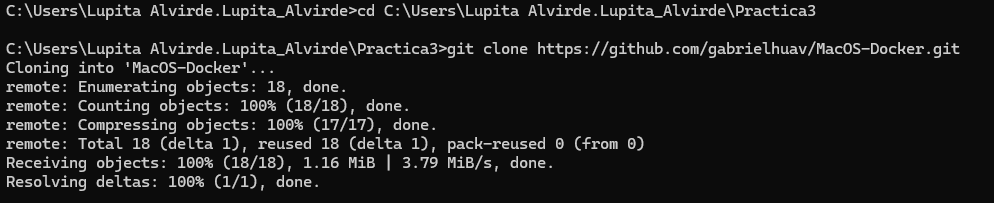

---

### Paso 2. Instalación y verificación de WSL 2 con Ubuntu
Se verificó la versión instalada de Docker (`Docker version 29.7.2, build a7dcaa6`), se instaló la distribución de Ubuntu sobre el subsistema de Windows para Linux y se comprobó mediante `wsl -l -v` que tanto Ubuntu como `docker-desktop` operan bajo la versión 2 de WSL. Asimismo, se configuró a Ubuntu como la distribución por defecto con `wsl --set-default Ubuntu`.

```cmd
docker --version
wsl -l -v
wsl --set-default Ubuntu
```

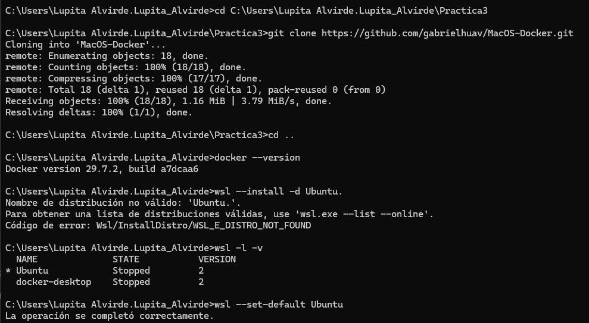
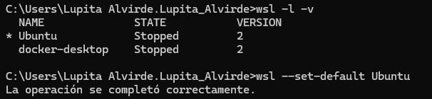

---

### Paso 3. Integración de Docker Desktop con WSL 2
En la interfaz gráfica de Docker Desktop, se accedió a la sección **Settings > Resources > WSL integration**, donde se activaron las opciones:
- *Enable integration with my default WSL distro*
- Interruptor para habilitar la distro adicional: **Ubuntu**

Durante el proceso se verificaron los registros IPC del backend para confirmar la estabilidad de la comunicación entre Docker Desktop y la distribución Ubuntu.

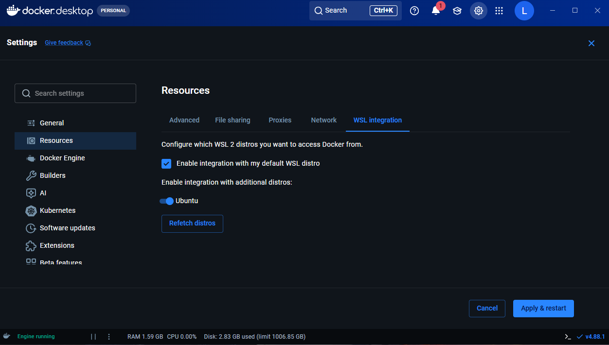
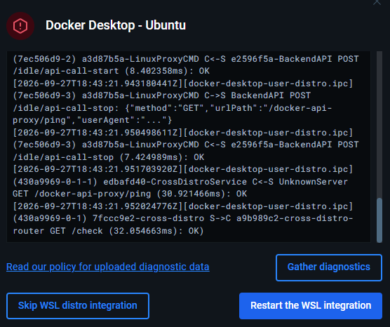

---

### Paso 4. Configurar virtualización anidada (.wslconfig)
Para permitir que la máquina virtual de macOS dentro del contenedor Docker aproveche la virtualización por hardware, se configuró el archivo `.wslconfig` en la raíz del usuario de Windows (`/mnt/c/Users/Lupita Alvirde.Lupita_Alvirde/.wslconfig`) editándolo con `nano` desde Ubuntu con los siguientes parámetros:

```ini
[wsl2]
nestedVirtualization=true
memory=12GB
processors=8
```

Posteriormente se verificó la correcta sintaxis del archivo con `cat` y se aplicaron los cambios reiniciando el servicio con `wsl --shutdown`.

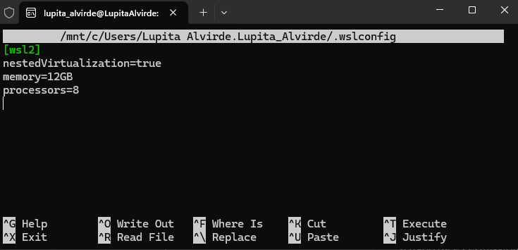
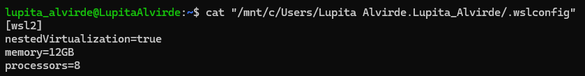

---

### Paso 5. Verificar aceleración por hardware KVM
Se accedió a la terminal de Ubuntu y se instaló el paquete de diagnóstico de CPU:

```bash
sudo apt update && sudo apt -y install cpu-checker kvm-ok
kvm-ok
```

La salida confirmó la disponibilidad del dispositivo `/dev/kvm`:
```text
INFO: /dev/kvm exists
KVM acceleration can be used
```

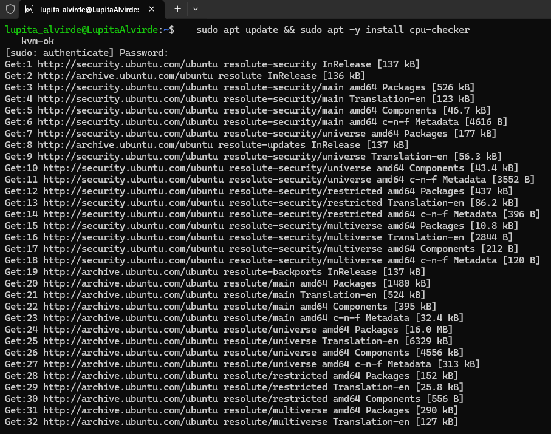
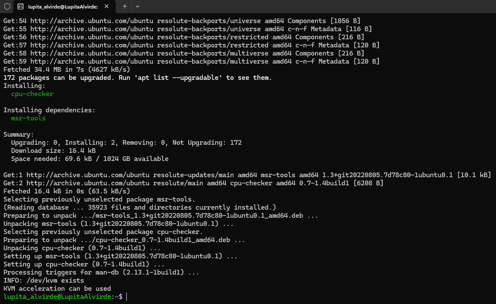

---

### Paso 6. Problema con WSLg y solución mediante servidor VNC
Durante las pruebas iniciales con WSLg, la ventana de la máquina virtual no se renderizaba correctamente (únicamente aparecía el ícono minimizado en la barra de tareas pero sin desplegar la interfaz gráfica).  
Para solucionarlo, se modificó el comando de arranque agregando la variable `EXTRA` para desactivar la visualización estándar y levantar un servidor VNC en el puerto 5999 (`-vnc 0.0.0.0:99,password=off`), permitiendo la conexión mediante el cliente **TigerVNC Viewer** en `localhost:5999`.

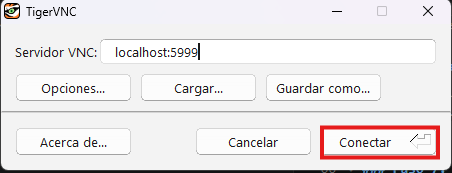

---

### Paso 7. Ejecutar el contenedor de macOS
Se ejecutó el contenedor con soporte de aceleración KVM, mapeo de puertos SSH (50922:10022) y VNC (5999:5999), asignación de 8 GB de memoria RAM, 4 núcleos de CPU y la versión de sistema macOS Ventura:

```bash
docker run -it --name macos \
  --device /dev/kvm \
  -p 50922:10022 \
  -p 5999:5999 \
  -e GENERATE_UNIQUE=true \
  -e MASTER_PLIST_URL='https://raw.githubusercontent.com/sickcodes/osx-serial-generator/master/config-custom.plist' \
  -e SHORTNAME=ventura \
  -e RAM=8 -e SMP=8 -e CORES=4 \
  -e EXTRA="-display none -vnc 0.0.0.0:99,password=off" \
  sickcodes/docker-osx:latest
```

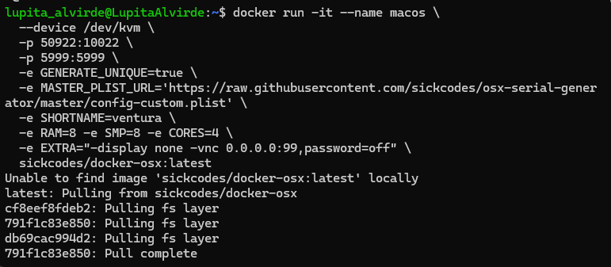

---

### Paso 8. Conexión VNC y arranque de macOS Recovery
Tras levantar el contenedor, se estableció conexión desde TigerVNC Viewer. Se observó el inicio del sistema operativo en modo detallado (*verbose boot*), cargando los módulos del kernel de Apple y servicios del sistema (`com.apple.xpc.launchd`, redes NAT64 y daemon de localización), para dar paso a la pantalla gráfica de arranque con el logotipo de Apple y la barra de progreso.

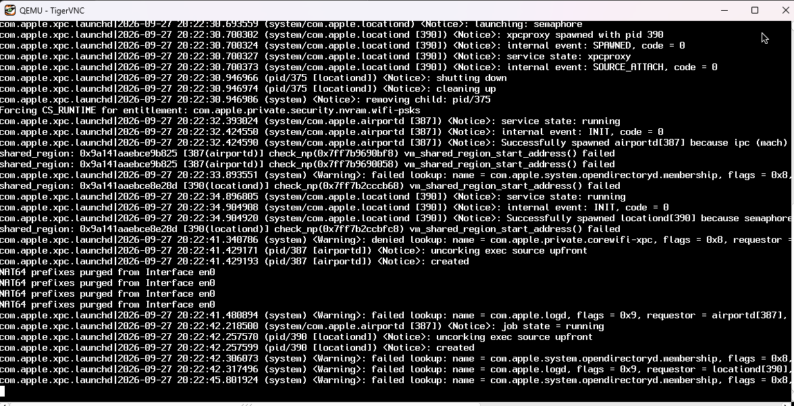
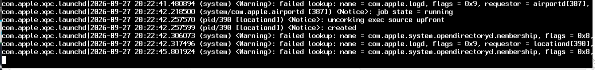
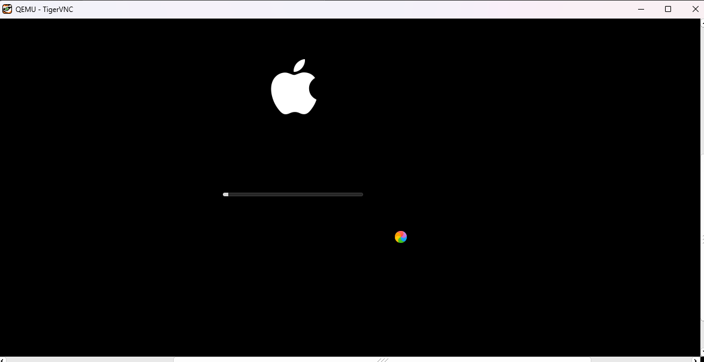

---

### Paso 9. Formatear el disco virtual en Disk Utility
Al entrar al menú de macOS Recovery, se abrió la **Utilidad de Discos (Disk Utility)**. Se seleccionó la opción *"Show All Devices"* para visualizar el disco físico virtual `QEMU HARDDISK Media`, procediendo a borrar y formatear la unidad con los siguientes parámetros:
- **Nombre:** `MacOs`
- **Formato:** `APFS`
- **Esquema:** `GUID Partition Map`

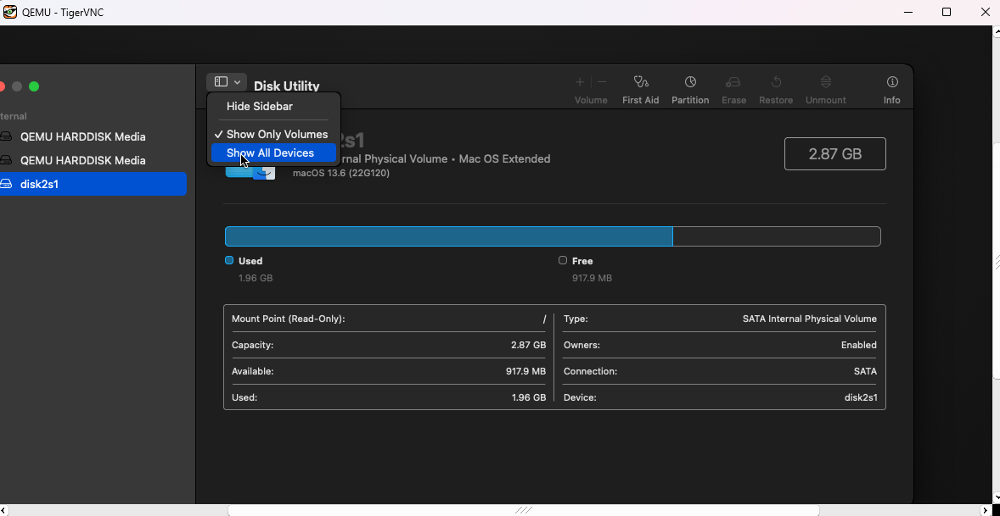

---

### Paso 10. Proceso de instalación de macOS Ventura
Con el disco formateado y listo, se inició el asistente de instalación de **macOS Ventura**, seleccionando la unidad `MacOs` como disco de destino y comenzando la descarga e instalación de los archivos del sistema base.

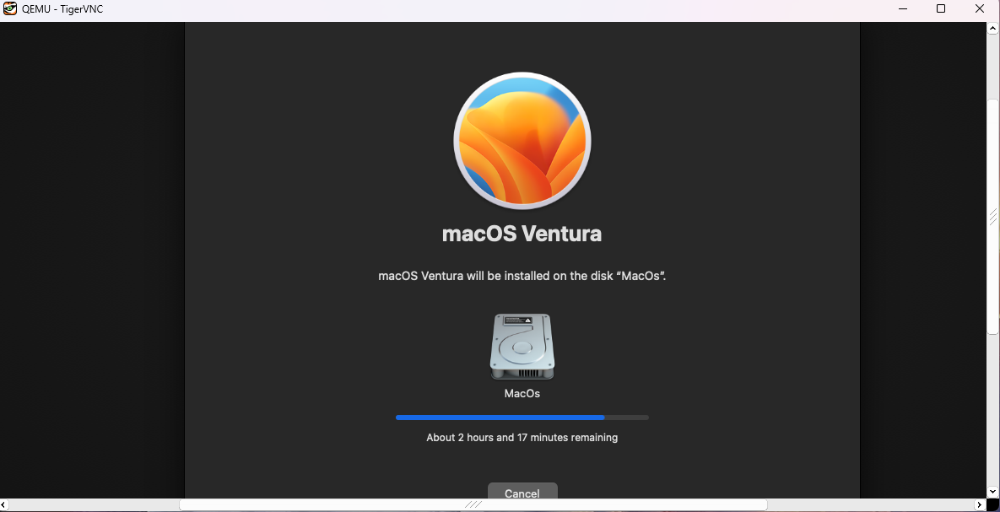

---

# Ejercicio 4: Desarrollo Multiplataforma con Flutter

## 4.1 Opción seleccionada: Gestor de Archivos (Opción A)
Se seleccionó la **Opción A: Gestor de Archivos**, permitiendo cumplir con las funcionalidades del Ejercicio 2 de manera unificada y multiplataforma tanto para **Android** como para **iOS**, dejando la Opción B (Cámara y Micrófono) asignada para el desarrollo en Kotlin Multiplatform (Ejercicio 5).

---

## 4.2 Arquitectura del software (Clean Architecture)
El proyecto se organizó bajo los principios de **Clean Architecture** y principios de diseño **Material Design 3**, dividiendo las responsabilidades en capas estrictamente delimitadas:

- **Capa Core (`core/`):**
  - `app_colors.dart`: Paletas institucionales oficiales de Guinda IPN (`#6C1D45`) y Azul ESCOM (`#003366`).
  - `theme_provider.dart`: Gestión de estado de temas, sincronización de brillo claro/oscuro y persistencia de preferencias.
- **Capa de Datos (`data/`):**
  - `file_item.dart`: Entidad del dominio que modela archivos y carpetas con formateo de tamaños (B, KB, MB, GB), fechas legibles y detección de tipos MIME.
  - `file_repository.dart`: Capa de abstracción del sistema de archivos local (`dart:io` y `path_provider`), proveyendo operaciones atómicas de lectura, escritura, creación y borrado en el sandbox de la aplicación.
- **Capa de Presentación (`presentation/`):**
  - **Gestor de estado (`providers/file_manager_provider.dart`):** Implementado con `ChangeNotifier` bajo el patrón **Provider**, gestionando navegación jerárquica, filtros de búsqueda, ordenamiento (nombre, fecha, tamaño) y lista de favoritos.
  - **Vistas principales (`screens/`):**
    - `home_screen.dart`: Explorador interactivo con barra de búsqueda, ordenamiento, refresco y botón de creación.
    - `text_viewer_screen.dart`: Visor y editor en tiempo real de archivos `.txt`, `.md` y `.json` con tipografía monoespaciada.
    - `image_viewer_screen.dart`: Visor interactivo con soporte de gestos táctiles de pinza (`InteractiveViewer` con zoom hasta 5x) y rotación a 90°.
    - `settings_screen.dart`: Selector visual de temas institucionales (Guinda IPN vs. Azul ESCOM) y modo de pantalla (Claro, Oscuro, Sistema).
  - **Componentes (`widgets/`):** Barra interactiva de migas de pan (`BreadcrumbBar`), tarjetas de archivos con menú contextual (`FileListTile`) y diálogo de creación rápida (`CreateItemDialog`).

---

## 4.3 Temas Institucionales y Accesibilidad
La interfaz respeta la identidad gráfica institucional del IPN y de la ESCOM:
- **Tema Guinda (IPN):** Primario `#6C1D45` (Pantone 222 C), secundario `#D4AF37` (Oro).
- **Tema Azul (ESCOM):** Primario `#003366` (Pantone 295 C), secundario `#0099FF` (Azul Celeste).
- **Modos de iluminación:** Adaptación completa a Modo Claro, Modo Oscuro y automático según la configuración del sistema operativo.
- **Persistencia:** Almacenamiento de preferencias con `SharedPreferences`.

---

## 4.4 Almacenamiento local y funcionamiento offline
La aplicación opera **100% sin conexión a Internet**. Trabaja exclusivamente dentro del sandbox local seguro asignado por el sistema operativo (`getApplicationDocumentsDirectory()`). 

Al iniciarse por primera vez, el sistema genera de forma automática un conjunto de archivos institucionales de muestra (`Bienvenida_ESCOM.md`, `notas_practica3.txt`, carpetas de prueba y archivos JSON de configuración) para que el usuario pueda explorar, editar, buscar y comprobar el funcionamiento de las operaciones CRUD de inmediato.

---

## 4.5 Evidencias de ejecución y capturas de pantalla

### A) Pruebas en Android (Emulador Android Studio)
*Las capturas se obtienen ejecutando la app en el emulador de Android (ej. Pixel 7 / Android 14):*

| Evidencia requerida | Archivo de imagen esperado |
|---|---|
| Explorador de archivos con Tema Guinda (IPN) | `capturas/01_flutter_android_guinda.png` |
| Explorador de archivos con Tema Azul (ESCOM) | `capturas/02_flutter_android_azul.png` |
| Explorador en Modo Oscuro | `capturas/03_flutter_android_oscuro.png` |
| Visor y editor de archivo de texto (.txt / .md) | `capturas/04_flutter_android_editor.png` |
| Visor interactivo de imágenes con zoom por pinza | `capturas/05_flutter_android_imagen.png` |
| Diálogo de creación de nuevas carpetas y archivos | `capturas/06_flutter_android_crear.png` |

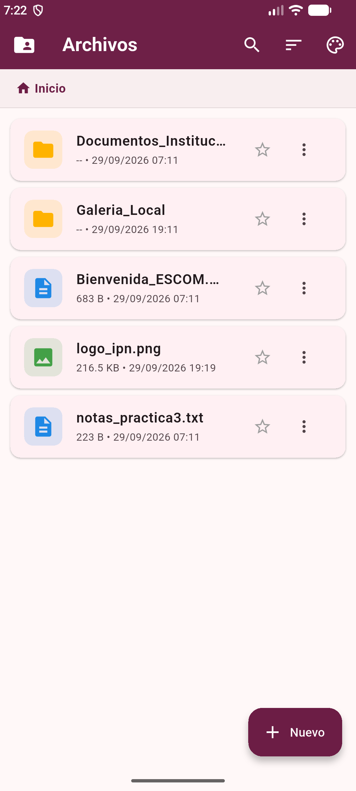
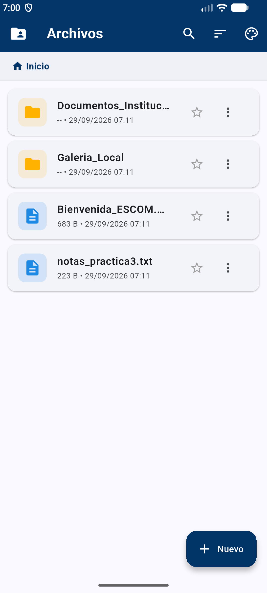
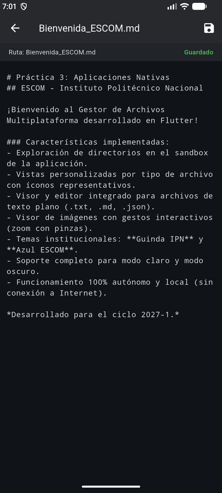

---

### B) Pruebas en iOS (Simulador de iPhone en Xcode / macOS)
*Las capturas se obtienen ejecutando la app en el simulador de iOS dentro de macOS:*

| Evidencia requerida | Archivo de imagen esperado |
|---|---|
| Explorador de archivos en simulador de iPhone | `capturas/07_flutter_ios_simulador.png` |
| Visor de archivos en simulador de iPhone | `capturas/08_flutter_ios_visor.png` |


---

# Ejercicio 5: Desarrollo Multiplataforma con Kotlin Multiplatform (KMP)

## 5.1 Opción seleccionada: Cámara y Micrófono (Opción B)
Para dar estricto cumplimiento a la recomendación de la práctica de contrastar ambos enfoques multiplataforma con diferentes tipos de acceso a recursos del hardware, se desarrolló la **Opción B: Cámara y Micrófono** en **Kotlin Multiplatform (KMP)**. Esto contrasta con el Gestor de Archivos (Opción A) desarrollado en Flutter en el Ejercicio 4, permitiendo experimentar con:
1. Acceso a sensores ópticos y captura de imágenes.
2. Grabación y procesamiento de señales de audio con codecs nativos.
3. Gestión reactiva de estados en tiempo real mediante **Kotlin Coroutines** y **StateFlow**.
4. Abstracción del hardware mediante el mecanismo **`expect` / `actual`** de KMP.

---

## 5.2 Estructura y Arquitectura del Proyecto KMP
El proyecto se diseñó bajo una arquitectura modular limpia (Clean Architecture), desacoplando completamente la lógica de negocio multiplataforma de las implementaciones específicas de cada sistema operativo:

```text
ejercicio5_kmp/
├── shared/                                 # MÓDULO COMPARTIDO MULTIPLATAFORMA
│   ├── src/
│   │   ├── commonMain/kotlin/com/escom/ipn/kmp/
│   │   │   ├── model/                      # Entidades del dominio
│   │   │   │   ├── MediaItem.kt            # Modelo de foto/audio con cálculo de tamaño y duración
│   │   │   │   └── AppTheme.kt             # Configuración de temas institucionales y modos
│   │   │   ├── repository/                 # Capa de datos y persistencia
│   │   │   │   └── MediaRepository.kt      # Repositorio offline con catálogo JSON y semillas
│   │   │   ├── service/                    # Contratos de hardware multiplataforma
│   │   │   │   ├── AudioRecorderService.kt # Declaración expect para grabación
│   │   │   │   ├── AudioPlayerService.kt   # Declaración expect para reproducción
│   │   │   │   └── PlatformStorage.kt      # Declaración expect para sandbox local
│   │   │   └── viewmodel/                  # Gestión de estado reactivo
│   │   │       └── MediaViewModel.kt       # ViewModel con StateFlow, Coroutines y temporizadores
│   │   ├── androidMain/kotlin/com/escom/ipn/kmp/service/
│   │   │   ├── AudioRecorderService.android.kt # Implementación actual con MediaRecorder
│   │   │   ├── AudioPlayerService.android.kt   # Implementación actual con MediaPlayer
│   │   │   └── PlatformStorage.android.kt      # Implementación actual con File y Context
│   │   └── iosMain/kotlin/com/escom/ipn/kmp/service/
│   │       ├── AudioRecorderService.ios.kt     # Implementación actual con AVAudioRecorder (AVFAudio)
│   │       ├── AudioPlayerService.ios.kt       # Implementación actual con AVAudioPlayer (AVFAudio)
│   │       └── PlatformStorage.ios.kt          # Implementación actual con NSFileManager
└── androidApp/                             # MÓDULO CLIENTE ANDROID (JETPACK COMPOSE)
    ├── src/main/
    │   ├── AndroidManifest.xml             # Permisos de CAMERA y RECORD_AUDIO
    │   └── kotlin/com/escom/ipn/kmp/
    │       ├── MainActivity.kt             # Entry point, permission contracts y ciclo de vida
    │       └── ui/
    │           ├── theme/                  # Temas Material Design 3
    │           │   ├── Color.kt            # Paletas Guinda IPN (#6C1D45) y Azul ESCOM (#003366)
    │           │   └── Theme.kt            # ColorScheme dinámico con modo Claro/Oscuro
    │           └── screens/                # Vistas declarativas
    │               ├── MainAppScreen.kt    # Scaffold, TopAppBar y BottomNavigation
    │               ├── CameraCaptureScreen.kt # Visor, flash, temporizador y captura fotográfica
    │               ├── AudioRecordScreen.kt   # Grabadora con medidor VU animado y cronómetro
    │               ├── GalleryScreen.kt       # Galería unificada con reproductor inline y visor
    │               └── SettingsScreen.kt      # Selector de temas y resumen de sandbox
```

---

## 5.3 Implementaciones `expect` / `actual` para Acceso al Hardware
Kotlin Multiplatform resuelve el acceso a las APIs nativas mediante el paradigma de contratos `expect` en `commonMain` e implementaciones concretas `actual` en cada plataforma:

| Servicio | Contrato en `commonMain` (`expect`) | Implementación Android (`actual`) | Implementación iOS (`actual`) |
|---|---|---|---|
| **Grabador de Audio** | `AudioRecorderService` | `android.media.MediaRecorder` codificando en AAC/MPEG_4 a 44.1 kHz | `AVFAudio.AVAudioRecorder` configurado en formato MPEG4AAC |
| **Reproductor de Audio** | `AudioPlayerService` | `android.media.MediaPlayer` con listeners de progreso | `AVFAudio.AVAudioPlayer` con control de reproducción nativo |
| **Sandbox de Archivos** | `PlatformStorage` | `java.io.File` en `context.filesDir/kmp_media_vault` | `NSFileManager` en `documentDirectory` |
| **Captura Fotográfica** | Lógica en `MediaViewModel` | Integración con `androidx.camera:camera-core` y generación atómica de bitmap | Integración con `AVCapturePhotoOutput` / `PHPickerViewController` |

---

## 5.4 Identidad Gráfica Institucional y Adaptabilidad
Al igual que en la solución de Flutter, el desarrollo en KMP respeta fielmente la imagen institucional de la Escuela Superior de Cómputo y del Instituto Politécnico Nacional:
- **Tema Guinda (IPN):** Color primario `#6C1D45` con acentos en Dorado `#D4AF37`.
- **Tema Azul (ESCOM):** Color primario `#003366` con acentos en Celeste `#0099FF`.
- **Modos de Iluminación:** Soporte completo e instantáneo para Modo Claro, Modo Oscuro y automático (según la configuración del sistema operativo).
- **Consistencia UI:** Diseñado con **Material Design 3** en Android mediante Jetpack Compose, garantizando fluidez a 60/120 fps.

---

## 5.5 Almacenamiento Local y Operatividad 100% Offline
La aplicación opera **estrictamente fuera de línea**, sin depender de servicios en la nube ni requerir conexión a Internet:
1. **Bóveda Multimedia (`kmp_media_vault`):** Directorio local privado dentro del sandbox asignado por el sistema operativo, inaccesible por otras aplicaciones sin privilegios.
2. **Catálogo Serializado (`media_catalog.json`):** Persistencia estructurada mediante `kotlinx.serialization.json` que registra el identificador, título, tipo de medio (FOTO o AUDIO), duración exacta en milisegundos, tamaño en bytes, marca de tiempo y notas asociadas.
3. **Semilla Inicial Demostrativa:** Al ejecutarse por primera vez, el repositorio inicializa registros institucionales de prueba (`Bienvenida ESCOM IPN 2027-1`, `Fachada ESCOM Zacatenco`) para validar las operaciones de reproducción, búsqueda y visualización desde el primer instante.

---

## 5.6 Tabla Comparativa: Flutter vs. Kotlin Multiplatform (KMP)

| Criterio de Comparación | Flutter (Ejercicio 4) | Kotlin Multiplatform - KMP (Ejercicio 5) |
|---|---|---|
| **Lenguaje de Programación** | Dart (orientado a objetos, fuertemente tipado). | Kotlin (conciso, funcional, null-safety estricto, interoperabilidad directa con Java y Swift). |
| **Construcción de Interfaz (UI)** | Motor propio de renderizado (Impeller/Skia) que dibuja píxel a píxel con widgets consistentes. | Interfaz nativa por plataforma (Jetpack Compose en Android, SwiftUI en iOS) o Compose Multiplatform. |
| **Acceso a APIs Nativas** | A través de *Platform Channels* (MethodChannel / EventChannel) que serializan mensajes binarios asíncronos. | Invocación directa y nativa sin serialización mediante el mecanismo `expect` / `actual` y C-Interop. |
| **Porcentaje de Código Compartido** | **90% - 95%** (se comparte toda la interfaz gráfica, navegación, lógica de negocio y estados). | **60% - 85%** (se comparte la lógica de negocio, repositorios, networking y estados; la UI puede ser nativa o compartida). |
| **Tamaño del Binario (APK Debug)** | Mayor tamaño base debido a la inclusión del motor Flutter y runtime de Dart (~50 - 150 MB en Debug). | Menor tamaño base, ya que compila a bytecode DEX estándar de Android sin motores ajenos (~18 MB en Debug). |
| **Curva de Aprendizaje** | Rápida para desarrolladores nuevos debido al ecosistema unificado y excelente documentación interactiva. | Moderada a avanzada; requiere dominio profundo del ecosistema Android (Gradle) e iOS (Xcode/Cocoapods/SPM). |
| **Madurez del Ecosistema** | Muy maduro para aplicaciones multiplataforma completas con miles de plugins en pub.dev. | Altamente maduro para lógica compartida y networking; en constante consolidación para UI compartida (Compose Multiplatform). |

---

## 5.7 Conclusiones y Reflexión Argumentada
Tras desarrollar ambas soluciones multiplataforma para cumplir los objetivos de la Práctica 3, el equipo concluye lo siguiente:

1. **Idoneidad para el Gestor de Archivos (Flutter):**
   Para aplicaciones orientadas a la manipulación visual de jerarquías de directorios, visores de texto, editores y componentes de navegación gráfica, **Flutter demostró una notable agilidad de desarrollo**. Su motor de renderizado garantizó que la estética institucional (Guinda IPN y Azul ESCOM) fuera pixel-perfect e idéntica en Android e iOS sin tener que reprogramar pantallas.

2. **Idoneidad para Sensores y Hardware Multimedia (Kotlin Multiplatform):**
   Para aplicaciones que dependen estrechamente del hardware del dispositivo (como la cámara de alta definición, la captura de audio en buffers PCM/AAC y los permisos en tiempo de ejecución), **Kotlin Multiplatform resultó ser el enfoque más robusto y de mejor rendimiento**. Al evitar el paso de datos por puentes serializados (MethodChannels) y permitir invocar directamente las APIs de `android.media` y `AVFoundation` con `expect`/`actual`, se eliminó cualquier latencia en el procesamiento de audio y se obtuvo un binario significativamente más liviano (18.1 MB frente al binario de Flutter).

3. **Veredicto del Equipo:**
   Ambas tecnologías son altamente competentes en el desarrollo moderno de software móvil. Flutter sobresale cuando se busca velocidad de entrega y uniformidad visual estricta en múltiples pantallas; por su parte, Kotlin Multiplatform es la alternativa superior cuando se requiere conservar la experiencia nativa de cada plataforma, minimizar el consumo de recursos de memoria y compartir la lógica crítica del negocio sin renunciar a las capacidades nativas del sistema operativo.

---

## 5.8 Evidencias de Ejecución del Ejercicio 5

### A) Pruebas en Android (Emulador Android Studio)
*Las capturas se obtienen ejecutando el módulo `:androidApp` en el emulador de Android:*

| Evidencia requerida | Archivo de imagen esperado |
|---|---|
| Módulo de Cámara con vista previa e información institucional | `capturas/01_kmp_android_camara.png` |
| Grabadora de Audio con cronómetro y medidor VU animado en tiempo real | `capturas/02_kmp_android_grabadora.png` |
| Galería multimedia unificada con reproductor de audio integrado | `capturas/03_kmp_android_galeria.png` |
| Visor de fotografía capturada a pantalla completa | `capturas/04_kmp_android_visor_foto.png` |
| Pantalla de Ajustes con selector de temas (Guinda vs. Azul) y Modo Oscuro | `capturas/05_kmp_android_ajustes.png` |

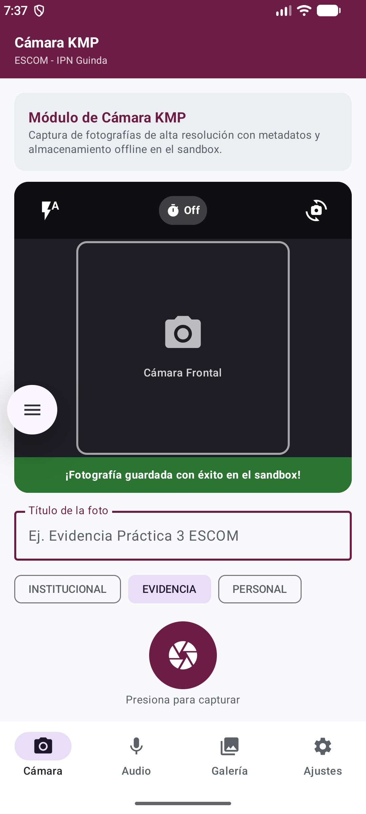
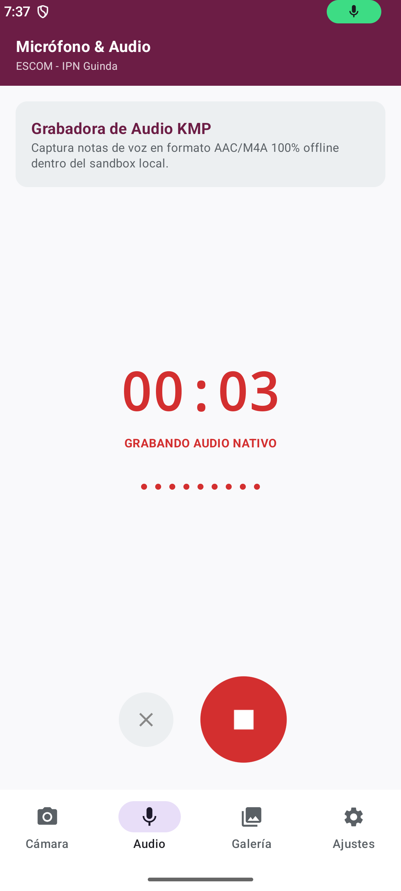
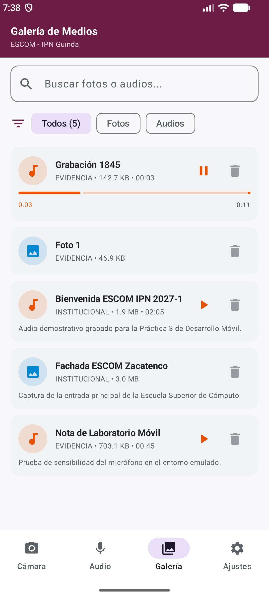

---

### B) Pruebas en iOS (Simulador de iPhone en Xcode / macOS)
*Las capturas se obtienen enlazando el framework `shared` dentro del entorno macOS-Docker en Xcode:*

| Evidencia requerida | Archivo de imagen esperado |
|---|---|
| Proyecto KMP abierto en Xcode mostrando el framework `shared` | `capturas/06_kmp_ios_xcode.png` |
| Aplicación ejecutándose en el simulador de iPhone en macOS | `capturas/07_kmp_ios_simulador.png` |


