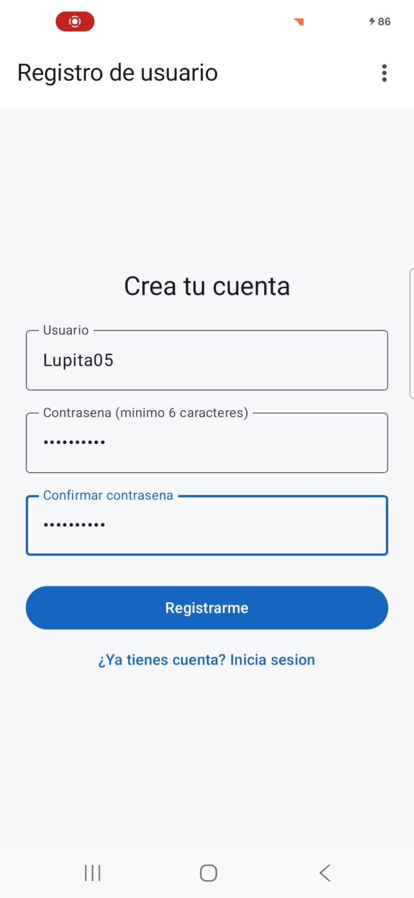
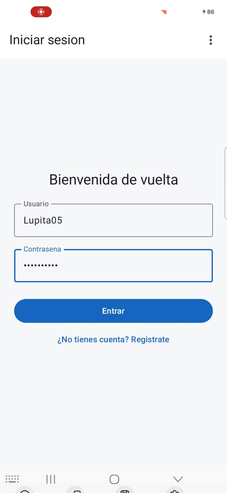
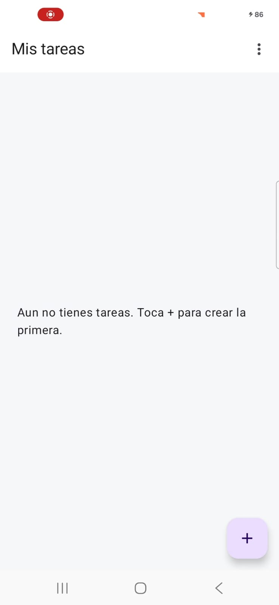
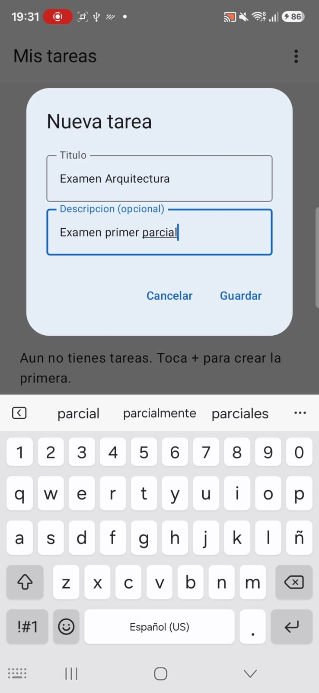
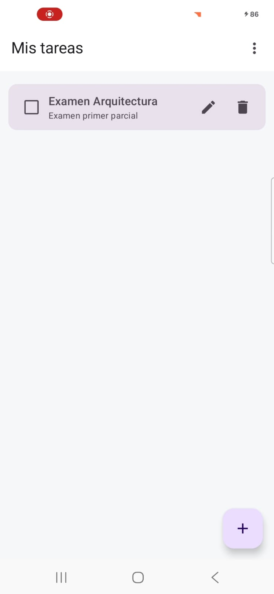
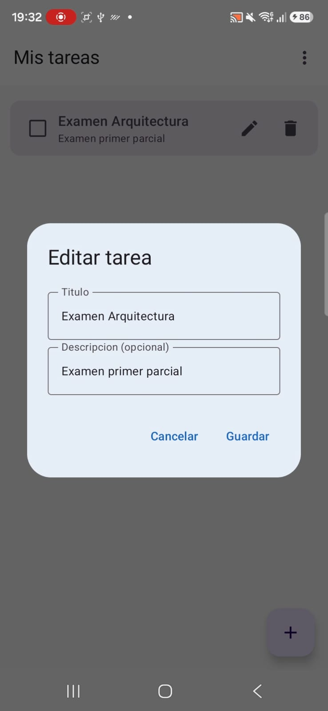
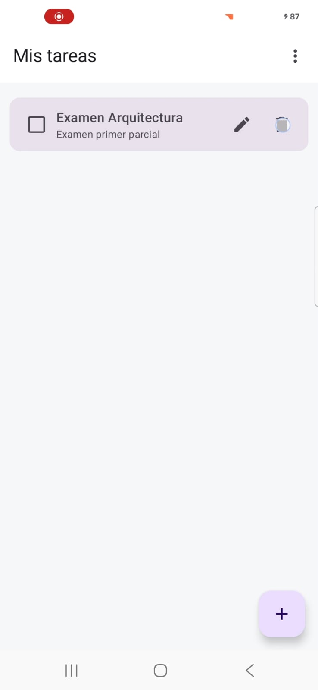
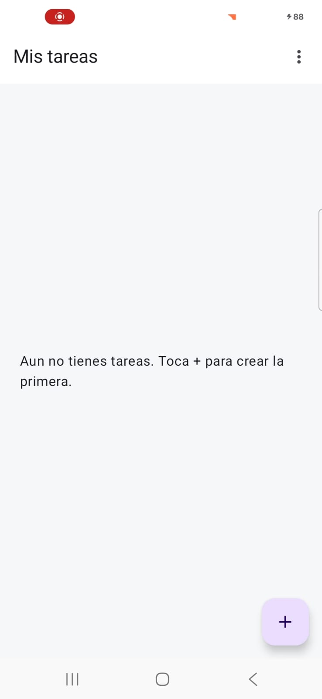
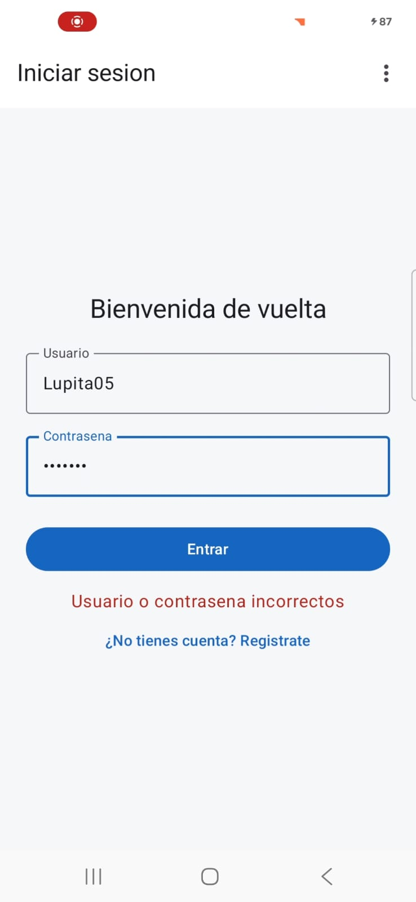

# Práctica 2: Aplicación móvil básica para operaciones CRUD con un servicio REST

## Portada

- **Nombre completo:** María Guadalupe Hernández Alvirde
- **Número de boleta:** 2022630105
- **Grupo:** 5CV4
- **Unidad de aprendizaje:** Desarrollo de aplicaciones móviles nativas
- **Nombre del profesor(a):** Gabriel Hurtado Avilés
- **Fecha de entrega:** 18 de septiembre de 2026

---

## Introducción

App móvil en **Kotlin + Jetpack Compose** que consume un backend propio en **Flask** (dockerizado)
para hacer CRUD sobre un recurso de **Tareas**, con registro/login y sesiones protegidas por JWT.

```
practica2/
├── backend/    -> API REST en Flask, dockerizada
└── android/    -> App Android en Kotlin + Jetpack Compose
```

**Stack y justificación:** Flask + Flask-SQLAlchemy + Flask-Bcrypt + Flask-JWT-Extended sobre SQLite
en el backend (se tomó como referencia conceptual el repo de ejemplo de la práctica, pero se construyó
uno nuevo con blueprints y JWT en vez de sesiones de Flask). En la app, Retrofit + OkHttp como cliente
HTTP y DataStore para persistir el token JWT en el dispositivo.

**Flujo:** el usuario se registra (contraseña hasheada con bcrypt) → inicia sesión y recibe un JWT →
la app guarda el token en DataStore → con ese token consume `/tasks` (crear, listar, editar, eliminar,
marcar como completada) → si el token expira o es inválido, el backend responde `401` y la app regresa
al login.

---

## Desarrollo

### Conceptos del Ejercicio 2

- **Docker:** empaqueta la app con su runtime y dependencias en un contenedor aislado; comparte el
  kernel del anfitrión (arranca en segundos) y garantiza que el backend corra igual en cualquier equipo.
- **Imagen y contenedor:** la imagen es la plantilla inmutable; el contenedor es la instancia en
  ejecución (efímero). La base SQLite se guarda en el volumen `./instance:/app/instance`.
- **Dockerfile:** parte de `python:3.11-slim`, instala `requirements.txt`, copia el código, expone el
  puerto `5000` y ejecuta `python run.py`.
- **docker-compose.yml:** define el servicio `api`, su puerto (`5000:5000`), el volumen y las variables
  de entorno (`JWT_SECRET_KEY`, `JWT_EXPIRES_MINUTES`), para levantar todo con un solo comando.
- **Backend/REST:** expone rutas HTTP (`GET/POST/PUT/DELETE`), valida, consulta/modifica la base y
  responde en JSON con el código de estado correspondiente.
- **ORM:** SQLAlchemy representa `User` y `Task` como clases de Python en vez de SQL directo; la base
  (`instance/app.db`) se crea sola al arrancar.

### Endpoints

Base local: `http://localhost:5000` · Desde emulador Android: `http://10.0.2.2:5000`

| Método | Ruta | Auth | Descripción | Códigos |
|---|---|---|---|---|
| GET | `/` | No | Verifica que el servicio está arriba | 200 |
| POST | `/register` | No | Crea usuario (`username`, `password`), hashea con bcrypt | 201, 400 |
| POST | `/login` | No | Valida credenciales, regresa `access_token` (JWT) | 200, 401 |
| GET | `/tasks` | Bearer | Lista las tareas del usuario autenticado | 200 |
| POST | `/tasks` | Bearer | Crea tarea (`title`, `description`) | 201, 400 |
| GET | `/tasks/<id>` | Bearer | Obtiene una tarea propia | 200, 404 |
| PUT | `/tasks/<id>` | Bearer | Actualiza `title`/`description`/`completed` | 200, 400, 404 |
| DELETE | `/tasks/<id>` | Bearer | Elimina una tarea propia | 200, 404 |

Ejemplo de petición/respuesta:

```json
POST /login
{ "username": "lupita", "password": "clave123" }

200 OK
{ "access_token": "eyJhbGciOi...", "user": { "id": 1, "username": "lupita" } }

401 Unauthorized
{ "error": "Usuario o contrasena incorrectos" }
```

Los endpoints de `/tasks` requieren el header `Authorization: Bearer <access_token>` y solo
afectan tareas del usuario dueño del token.

### Instalación y ejecución

**Backend** (requiere Docker Desktop):
```bash
cd backend
docker compose up --build
```
Queda disponible en `http://localhost:5000`. Se probó con `curl` el flujo completo (registro, login,
las 4 operaciones CRUD y los errores 400/401/404) antes de conectar la app.

**App móvil:**
1. Abrir la carpeta `android/` en Android Studio y dejar que sincronice Gradle.
2. Con el backend corriendo, ejecutar en un **emulador** (usa `10.0.2.2:5000`, ya configurado en
   [`RetrofitClient.kt`](android/app/src/main/java/com/tareasapp/mobile/data/remote/RetrofitClient.kt))
   o en un **dispositivo físico** en la misma red Wi-Fi (cambiando `BASE_URL` por la IP local del
   equipo, ej. `http://192.168.1.50:5000/`).
3. Como se consume por HTTP sin TLS (desarrollo), el manifiesto declara `usesCleartextTraffic="true"`
   y el permiso `INTERNET`.

### Capturas de pantalla

| Registro | Login | Lista de tareas |
|---|---|---|
|  |  |  |

| Crear tarea | Editar tarea | Editar tarea |
|---|---|---|
|  |  |  |

| Eliminar tarea | Después de eliminar | Credenciales incorrectas |
|---|---|---|
|  |  |  |

---

## Conclusiones

El mayor reto no fue el backend (ya había usado Flask antes), sino decidir cómo persistir la sesión en
la app: terminé usando `DataStore` para no pedir login cada vez que se abre la app. También tuve que
recordar que el emulador no ve `localhost` como la propia PC (`10.0.2.2`), y al probar en un
dispositivo físico me encontré con que el Firewall de Windows bloqueaba el puerto 5000 por tener la red
Wi-Fi configurada como "Pública" — se resolvió cambiándola a "Privada".

Como logro, el backend quedó completamente probado con `curl` (los 4 verbos CRUD y los errores
400/401/404) antes de tocar la parte de Android, lo que ayudó a detectar dos errores de validación
sin depurar desde la app. Pendiente para una siguiente iteración: agregar refresh token y pruebas
automatizadas con `pytest`.

---

## Bibliografía

- Grinberg, M. (2018). *Flask Web Development: Developing Web Applications with Python* (2.a ed.). O'Reilly Media.
- Pallets Projects. (2024). *Flask Documentation*. https://flask.palletsprojects.com/
- Flask-JWT-Extended. (2024). *Documentation*. https://flask-jwt-extended.readthedocs.io/
- Flask-Bcrypt. (2024). *Documentation*. https://flask-bcrypt.readthedocs.io/
- SQLAlchemy. (2024). *ORM Documentation*. https://docs.sqlalchemy.org/
- Docker Inc. (2024). *Docker Compose Documentation*. https://docs.docker.com/compose/
- Google. (2024). *Jetpack Compose Documentation*. https://developer.android.com/jetpack/compose
- Square, Inc. (2024). *Retrofit Documentation*. https://square.github.io/retrofit/
- Google. (2024). *DataStore Documentation*. https://developer.android.com/topic/libraries/architecture/datastore
- Huav, G. (2024). *Flask-Compose-Login-API* [Repositorio de GitHub, referencia conceptual]. https://github.com/gabrielhuav/Flask-Compose-Login-API
